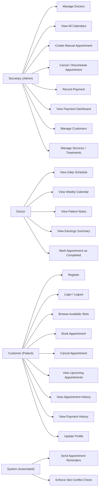
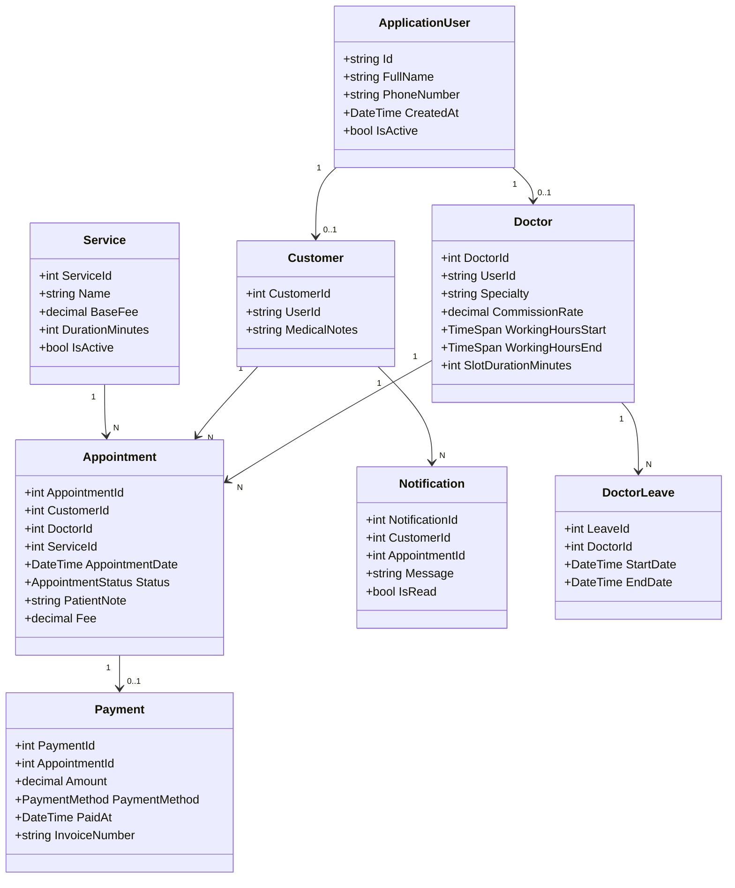

# 4+1 Software Architecture Document (SAD) — Phase 1
## Dental Clinic Online Appointment & Management System

---

> **Document Version:** 1.0  
> **Date:** 2026-04-30  
> **Methodology:** Kruchten's 4+1 Architectural View Model  
> **Technology Stack:** ASP.NET Core MVC · Entity Framework Core · SQL Server · Bootstrap 5

---

## 0. System Selection

### 0.1 System Definition
The selected system is a **Dental Clinic Online Appointment & Management System** designed to support appointment operations, role-based access, and core clinic administration in a single web platform.

### 0.2 Purpose of the System
The system aims to digitalize and coordinate daily clinic workflows that are traditionally handled manually (phone booking, paper-based schedule tracking, and fragmented payment records). It provides a structured software solution aligned with modern architecture principles.

### 0.3 Target Users
- **Secretary (Admin):** manages doctors, appointments, services, customers, and payments.
- **Doctor:** monitors personal schedule, patient notes, and appointment completion status.
- **Customer (Patient):** registers, logs in, books appointments, and tracks upcoming/past visits.
- **System (Automated):** executes reminder generation as an internal background process.

### 0.4 Main Functionalities
- Role-based authentication and authorization.
- Appointment slot browsing and booking.
- Appointment cancellation and completion lifecycle.
- Secretary-side calendar, doctor management, and payment recording.
- Revenue and earnings visibility based on appointment/payment data.
- Automated in-app reminder generation for upcoming appointments.
- Slot conflict prevention and business-rule enforcement.

---

## 1. Use Case View (Scenarios View)

The Use Case View captures the **functional requirements** from each actor's perspective. It serves as the central document that drives all other architectural views.

### 1.1 System Actors

| Actor | Role | Authority Level |
|-------|------|-----------------|
| **Secretary (Admin)** | System administrator and clinic operations manager | Full system access |
| **Doctor** | Licensed dental practitioner | Restricted to own schedule & data |
| **Customer (Patient)** | Registered clinic patient | Self-service appointment management |
| **System (Automated)** | Background job / scheduler | Internal only — no login |

---

### 1.2 Use Cases by Actor

#### 🧑‍💼 Secretary (Admin) Use Cases

| ID | Use Case | Description |
|----|----------|-------------|
| UC-S01 | **Login / Logout** | Authenticates into the admin panel using credentials. |
| UC-S02 | **Manage Doctors** | Creates, updates, activates, or deactivates doctor profiles. |
| UC-S03 | **View All Calendars** | Views the daily/weekly appointment calendar for all doctors simultaneously. |
| UC-S04 | **Create Manual Appointment** | Creates a new appointment on behalf of a patient (phone-in booking). |
| UC-S05 | **Cancel / Reschedule Appointment** | Cancels or moves any appointment in the system. |
| UC-S06 | **Record Payment** | Records a payment against a completed appointment, entering amount and method. |
| UC-S07 | **Generate Invoice** | Creates a printable or PDF invoice for a patient's visit. |
| UC-S08 | **View Payment Dashboard** | Displays total revenue, outstanding payments, and per-doctor earnings summaries. |
| UC-S09 | **Manage Customers** | Views patient list, can deactivate accounts or reset passwords. |
| UC-S10 | **Manage Services / Treatments** | Defines available dental treatments and their base fees. |

---

#### 🦷 Doctor Use Cases

| ID | Use Case | Description |
|----|----------|-------------|
| UC-D01 | **Login / Logout** | Authenticates into the doctor's private dashboard. |
| UC-D02 | **View Daily Schedule** | Views the list of today's appointments in chronological order. |
| UC-D03 | **View Weekly Calendar** | Views a 7-day calendar of their upcoming appointments. |
| UC-D04 | **View Patient Notes** | Reads notes attached to each upcoming appointment by the patient or secretary. |
| UC-D05 | **View Earnings Summary** | Views their calculated fee/commission for the current day or week based on completed appointments. |
| UC-D06 | **Mark Appointment as Completed** | Changes appointment status to "Completed" after the patient's visit. |

---

#### 👤 Customer (Patient) Use Cases

| ID | Use Case | Description |
|----|----------|-------------|
| UC-C01 | **Register** | Creates a new patient account with name, contact info, and password. |
| UC-C02 | **Login / Logout** | Authenticates into the patient portal. |
| UC-C03 | **Browse Available Slots** | Selects a doctor, a date, and views all unbooked time slots. |
| UC-C04 | **Book Appointment** | Reserves a selected time slot, optionally adding a complaint note. |
| UC-C05 | **Cancel Appointment** | Cancels an upcoming appointment (subject to cancellation policy). |
| UC-C06 | **View Upcoming Appointments** | Sees a list of all future confirmed appointments with reminders. |
| UC-C07 | **View Appointment History** | Reviews all past completed/cancelled appointments. |
| UC-C08 | **View Payment History** | Lists all invoices and payments associated with their account. |
| UC-C09 | **Update Profile** | Changes personal details or password. |

---

#### ⚙️ System (Automated) Use Cases

| ID | Use Case | Description |
|----|----------|-------------|
| UC-SYS01 | **Send Appointment Reminders** | Background job that checks for appointments within 24 hours and creates in-app notification records. |
| UC-SYS02 | **Enforce Slot Conflict Check** | Automatically rejects booking requests that overlap with an existing confirmed appointment for the same doctor. |

---

### 1.3 Use Case Diagram (Textual UML Representation)



### 1.4 Partial UI Implementation (Stage 1 Scope)

As required in Stage 1, partial UI implementation is represented by role-oriented interface modules:
- **Portal Entry & Role Login Screens:** separate access paths for Secretary, Doctor, and Customer.
- **Customer UI Flow:** appointment booking form (doctor/service/date-time selection), upcoming appointments view, and history navigation.
- **Doctor UI Flow:** dashboard-oriented schedule view and appointment status update action.
- **Secretary UI Flow:** dashboard, doctor creation/management, appointment handling, and payment recording interface.

The UI structure is organized under role-based view folders as documented in the project structure (e.g., `Views/Account`, `Views/Appointment`, `Views/Doctor`, `Views/Secretary`), which demonstrates partial front-end implementation aligned with use cases.

### 1.5 Business Rules

| BR | Rule |
|----|------|
| **BR-01** | No two appointments can be booked for the same Doctor at the same date and time. This is enforced at both the application layer (validation) and the database layer (unique constraint). |
| **BR-02** | A Customer can only cancel an appointment that is in `Pending` or `Confirmed` status. Completed appointments cannot be cancelled. |
| **BR-03** | A payment can only be recorded against an appointment in `Completed` status. |
| **BR-04** | A Doctor can only view appointments assigned to their own `DoctorId`; cross-doctor data is inaccessible. |
| **BR-05** | The system automatically generates a reminder notification for any `Confirmed` appointment 24 hours before its scheduled time. |
| **BR-06** | Doctor commission/earnings are calculated as: `AppointmentFee × DoctorCommissionRate`. |

---

## 2. Logical View

The Logical View describes the **static structure** of the system — the key domain entities, their attributes, and the relationships between them.

### 2.1 Entity Descriptions

#### `ApplicationUser` *(Identity base — extends ASP.NET Core IdentityUser)*

The central identity entity. All actors (Secretary, Doctor, Customer) are stored as `ApplicationUser` records differentiated by **Role**.

| Field | Type | Description |
|-------|------|-------------|
| `Id` | `string` (GUID) | Primary Key (inherited from IdentityUser) |
| `FullName` | `string` | Display name |
| `PhoneNumber` | `string` | Contact phone |
| `DateOfBirth` | `DateTime?` | Optional — for patient records |
| `CreatedAt` | `DateTime` | Account creation timestamp |
| `IsActive` | `bool` | Soft-delete flag |

**Roles:** `Secretary`, `Doctor`, `Customer` — managed via `AspNetRoles`.

---

#### `Doctor`

A profile entity that extends `ApplicationUser` with doctor-specific attributes. Linked 1-to-1 to an `ApplicationUser` in the `Doctor` role.

| Field | Type | Description |
|-------|------|-------------|
| `DoctorId` | `int` | Primary Key |
| `UserId` | `string` | FK → `ApplicationUser.Id` |
| `Specialty` | `string` | e.g., "Orthodontics", "Endodontics" |
| `CommissionRate` | `decimal` | Percentage of appointment fee earned (e.g., 0.70 = 70%) |
| `WorkingHoursStart` | `TimeSpan` | Start of daily working hours |
| `WorkingHoursEnd` | `TimeSpan` | End of daily working hours |
| `SlotDurationMinutes` | `int` | Default appointment duration (e.g., 30 mins) |

**Relationships:**
- 1 Doctor → N Appointments
- 1 Doctor → N DoctorLeave records

---

#### `Customer`

A profile entity for patients. Linked 1-to-1 to an `ApplicationUser` in the `Customer` role.

| Field | Type | Description |
|-------|------|-------------|
| `CustomerId` | `int` | Primary Key |
| `UserId` | `string` | FK → `ApplicationUser.Id` |
| `MedicalNotes` | `string?` | Secretary-entered patient medical background |

**Relationships:**
- 1 Customer → N Appointments
- 1 Customer → N Notifications

---

#### `Service` *(Treatment / Procedure)*

Represents dental treatments offered by the clinic.

| Field | Type | Description |
|-------|------|-------------|
| `ServiceId` | `int` | Primary Key |
| `Name` | `string` | e.g., "Root Canal", "Teeth Whitening" |
| `Description` | `string?` | Details of the service |
| `BaseFee` | `decimal` | Standard price for this service |
| `DurationMinutes` | `int` | Estimated appointment duration |
| `IsActive` | `bool` | Toggle service availability |

---

#### `Appointment`

The core transactional entity of the system.

| Field | Type | Description |
|-------|------|-------------|
| `AppointmentId` | `int` | Primary Key |
| `CustomerId` | `int` | FK → `Customer.CustomerId` |
| `DoctorId` | `int` | FK → `Doctor.DoctorId` |
| `ServiceId` | `int` | FK → `Service.ServiceId` |
| `AppointmentDate` | `DateTime` | The scheduled date and time of the visit |
| `Status` | `enum` | `Pending`, `Confirmed`, `Completed`, `Cancelled` |
| `PatientNote` | `string?` | Patient's complaint or note at time of booking |
| `SecretaryNote` | `string?` | Internal note added by the secretary |
| `Fee` | `decimal` | Actual fee charged (may differ from `BaseFee`) |
| `CreatedAt` | `DateTime` | When the appointment was booked |
| `CreatedByUserId` | `string?` | FK — null if self-booked, set if secretary created it |

**Business Logic:** A **unique composite constraint** on `(DoctorId, AppointmentDate)` enforces BR-01.

**Relationships:**
- N Appointments → 1 Doctor
- N Appointments → 1 Customer
- N Appointments → 1 Service
- 1 Appointment → 0..1 Payment

---

#### `Payment`

Records financial transactions for completed appointments.

| Field | Type | Description |
|-------|------|-------------|
| `PaymentId` | `int` | Primary Key |
| `AppointmentId` | `int` | FK → `Appointment.AppointmentId` (unique) |
| `Amount` | `decimal` | Amount paid |
| `PaymentMethod` | `enum` | `Cash`, `CreditCard`, `BankTransfer` |
| `PaidAt` | `DateTime` | Transaction timestamp |
| `RecordedByUserId` | `string` | FK → `ApplicationUser.Id` (the secretary) |
| `InvoiceNumber` | `string` | Auto-generated invoice reference |

**Relationships:**
- 1 Payment → 1 Appointment *(1-to-1)*

---

#### `Notification`

In-app alerts sent to customers (system-generated reminders).

| Field | Type | Description |
|-------|------|-------------|
| `NotificationId` | `int` | Primary Key |
| `CustomerId` | `int` | FK → `Customer.CustomerId` |
| `AppointmentId` | `int?` | FK → `Appointment.AppointmentId` |
| `Message` | `string` | Notification text |
| `IsRead` | `bool` | Read status |
| `CreatedAt` | `DateTime` | When the notification was generated |

---

#### `DoctorLeave`

Tracks doctor unavailability (vacation, conference, etc.).

| Field | Type | Description |
|-------|------|-------------|
| `LeaveId` | `int` | Primary Key |
| `DoctorId` | `int` | FK → `Doctor.DoctorId` |
| `StartDate` | `DateTime` | Leave start |
| `EndDate` | `DateTime` | Leave end |
| `Reason` | `string?` | Optional explanation |

---

### 2.2 Entity Relationship Summary

```
ApplicationUser (1) ──────── (1) Doctor
ApplicationUser (1) ──────── (1) Customer

Doctor     (1) ──────── (N) Appointment
Customer   (1) ──────── (N) Appointment
Service    (1) ──────── (N) Appointment

Appointment (1) ──────── (0..1) Payment
Customer    (1) ──────── (N)    Notification
Doctor      (1) ──────── (N)    DoctorLeave
```

### 2.3 Class Diagram (Mermaid)



### 2.4 Backend Structure and Partial Backend Implementation

The backend is organized with clear responsibility boundaries:
- **Controllers Layer:** handles HTTP requests and role-specific endpoints (`AccountController`, `AppointmentController`, `SecretaryController`, `DoctorController`, `NotificationController`).
- **Service Layer:** encapsulates business logic (`BookingService`, `PaymentService`, `ReminderBackgroundService`) and enforces core business rules.
- **Data Access Layer:** `AppDbContext` manages entity sets, relationships, constraints, and migrations.
- **Identity/Authorization Layer:** `ApplicationUser` + role model (`Secretary`, `Doctor`, `Customer`) provides role-scoped access.

Partial backend implementation in Stage 1 is evidenced by:
- appointment booking logic with slot and leave validation,
- payment recording logic with completed-status and uniqueness checks,
- background reminder workflow logic through hosted service behavior,
- domain entities and relationship definitions mapped to persistent storage.

---

## 3. Process View

The Process View captures the **dynamic behavior** of the system — the key workflows showing how components interact at runtime.

### 3.1 Process 1: Customer Books an Appointment (End-to-End)

This is the primary happy-path workflow.

**Actors involved:** Customer, System, Database

```
┌──────────────┐        ┌───────────────────────┐        ┌────────────────┐
│   Customer   │        │  AppointmentController │        │   Database     │
│  (Browser)   │        │  + BookingService      │        │  (SQL Server)  │
└──────┬───────┘        └───────────┬───────────┘        └───────┬────────┘
       │                            │                             │
  1.  ─┤ GET /Appointment/Book      │                             │
       │ (selects Doctor + Date)    │                             │
       ├──────────────────────────► │                             │
       │                            ├─ Query available slots ────►│
       │                            │◄─ Returns booked times ─────┤
       │                            │  (existing appointments)    │
       │◄── Returns Slot Picker UI ─┤                             │
       │                            │                             │
  2.  ─┤ POST /Appointment/Book     │                             │
       │ (Doctor, DateTime, Service,│                             │
       │  PatientNote)              │                             │
       ├──────────────────────────► │                             │
       │                            ├─ [VALIDATE] ModelState     │
       │                            ├─ [CHECK] Is slot taken? ───►│
       │                            │◄─ Slot is FREE ─────────────┤
       │                            ├─ [CHECK] Is doctor on leave?►│
       │                            │◄─ Doctor is AVAILABLE ───────┤
       │                            │                             │
       │                            ├─ Create Appointment record ►│
       │                            │  Status = "Confirmed"       │
       │                            │◄─ Appointment saved (ID=42) ┤
       │                            │                             │
       │                            ├─ Create Notification record►│
       │                            │  "Your appointment is       │
       │                            │   confirmed for [Date]"     │
       │◄── Redirect to             │                             │
       │    /Appointment/Confirmed  │                             │
       │    + Success toast         │                             │
```

**Step-by-Step Narrative:**

1. **Customer navigates** to the booking page and selects a `Doctor` and a `Date`.
2. **System queries** the database for all `Confirmed` appointments for that doctor on that date and generates a list of **available time slots** based on the doctor's `WorkingHoursStart`, `WorkingHoursEnd`, and `SlotDurationMinutes`.
3. **Customer selects** a slot, picks a `Service`, and optionally types a `PatientNote`.
4. **Customer submits** the form via `POST /Appointment/Book`.
5. **`BookingService.CreateAppointmentAsync()`** runs the following validation pipeline:
   - `ModelState.IsValid` check (server-side validation)
   - Conflict check: queries `Appointments` table for existing `(DoctorId, AppointmentDate)` match
   - Leave check: queries `DoctorLeave` for overlapping dates
6. If **conflict detected** → returns `400 Bad Request` with an error message ("This slot is no longer available").
7. If **slot is free** → creates a new `Appointment` record with `Status = Confirmed`.
8. **System simultaneously creates** a `Notification` record for the customer: *"Your appointment with Dr. [Name] on [Date] at [Time] is confirmed."*
9. **Customer is redirected** to their upcoming appointments view with a success notification.

---

### 3.2 Process 2: Secretary Records a Payment

**Actors involved:** Secretary, System, Database

```
┌───────────────┐     ┌──────────────────────┐     ┌──────────────┐
│   Secretary   │     │  PaymentController   │     │   Database   │
└──────┬────────┘     └──────────┬───────────┘     └──────┬───────┘
       │                         │                          │
  1.  ─┤ GET /Payment/Record     │                          │
       │ (filters by Completed   │                          │
       │  appointments)          │                          │
       ├───────────────────────► │                          │
       │                         ├─ Query Completed appts ─►│
       │◄── Returns payment form─┤◄─ Returns list ──────────┤
       │                         │                          │
  2.  ─┤ POST /Payment/Record    │                          │
       │ (AppointmentId, Amount, │                          │
       │  PaymentMethod)         │                          │
       ├───────────────────────► │                          │
       │                         ├─ Validate: Status ==     │
       │                         │   "Completed"? ─────────►│
       │                         │◄─ Yes ───────────────────┤
       │                         ├─ Validate: Payment       │
       │                         │   already exists? ──────►│
       │                         │◄─ No (not yet paid) ─────┤
       │                         ├─ Create Payment record ─►│
       │                         ├─ Generate InvoiceNumber  │
       │◄─ Redirect + Invoice    │◄─ Saved ─────────────────┤
       │   preview               │                          │
```

**Step-by-Step Narrative:**

1. Secretary navigates to the **"Record Payment"** page.
2. System loads all `Completed` appointments that do **not** yet have an associated `Payment` record.
3. Secretary selects an appointment, enters `Amount`, and selects `PaymentMethod`.
4. On submit, `PaymentService.RecordPaymentAsync()` validates:
   - Appointment status is `Completed`
   - No existing `Payment` for this `AppointmentId` (prevents double-payment)
5. A `Payment` record is created with an auto-generated `InvoiceNumber` (format: `INV-YYYYMMDD-{ID}`).
6. Secretary is shown a printable invoice preview.

---

### 3.3 Process 3: Automated Reminder Notification (Background Job)

**Actors involved:** System (Background Scheduler), Database, Customer (passive recipient)

```
┌──────────────────────────┐      ┌─────────────────┐
│  IHostedService          │      │   Database      │
│  (ReminderBackgroundJob) │      │   (SQL Server)  │
└───────────┬──────────────┘      └────────┬────────┘
            │                              │
  [Runs every hour via Timer]              │
            │                              │
            ├─ Query: Appointments WHERE ─►│
            │   Status = "Confirmed"       │
            │   AND AppointmentDate        │
            │   BETWEEN Now AND Now+24h    │
            │   AND NotificationSent=false │
            │◄─ Returns N appointments ────┤
            │                              │
            │  [For each appointment:]     │
            ├─ Insert Notification ───────►│
            │   "Reminder: Your appt       │
            │    is in less than 24hrs"    │
            ├─ Mark NotificationSent=true ►│
            │◄─ Saved ─────────────────────┤
            │                              │
  [Customer next opens portal]
            │
            Customer polls GET /Notification/Unread
            → Badge count updates
            → Reminder visible in notification center
```

**Implementation Note:** The background job is implemented as an `IHostedService` registered in `Program.cs`. It runs on a configurable `Timer` interval (default: every 60 minutes). The `Appointment` entity includes a `ReminderSent` boolean flag to prevent duplicate notifications.

---
## Summary — Stage 1 Coverage

This Stage 1 submission includes:
- **System Selection** (system definition, purpose, target users, and core functionalities),
- **Use Case View** (actors, use cases, interactions, business rules, and partial UI scope),
- **Logical View** (entity model, class diagram, component responsibilities, and partial backend scope),
- **Process View** (workflow behavior for booking, payment, and automated reminders).

Accordingly, the report is aligned with Stage 1 expectations: architectural foundation plus partial frontend and backend implementation evidence.
