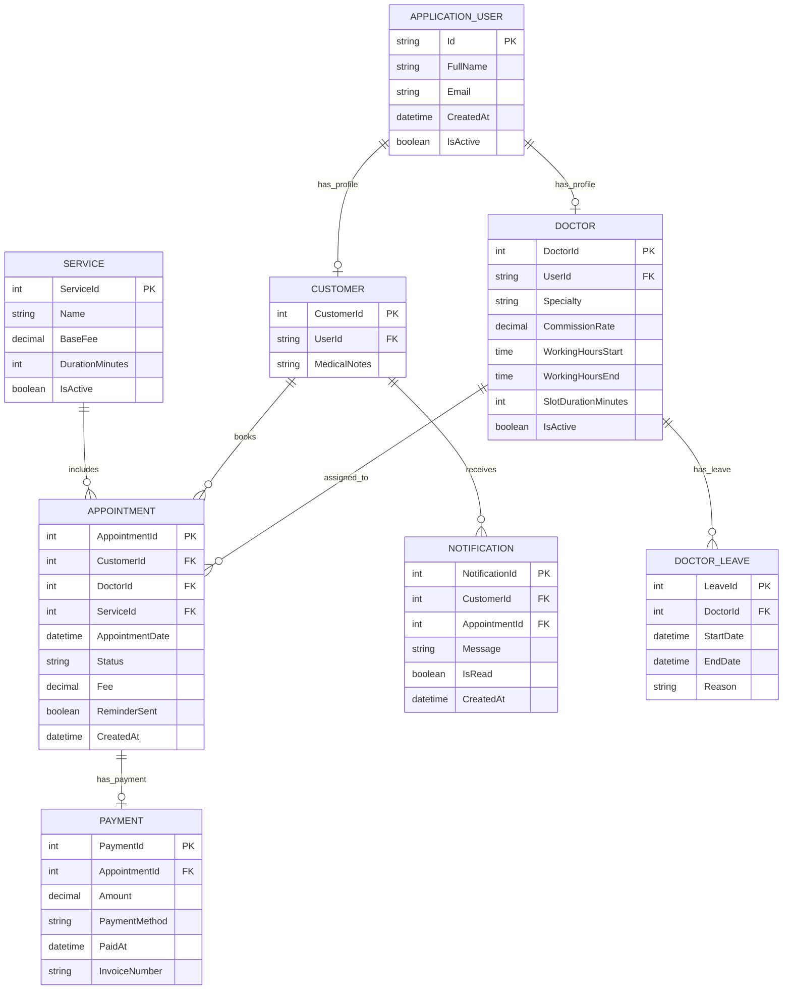
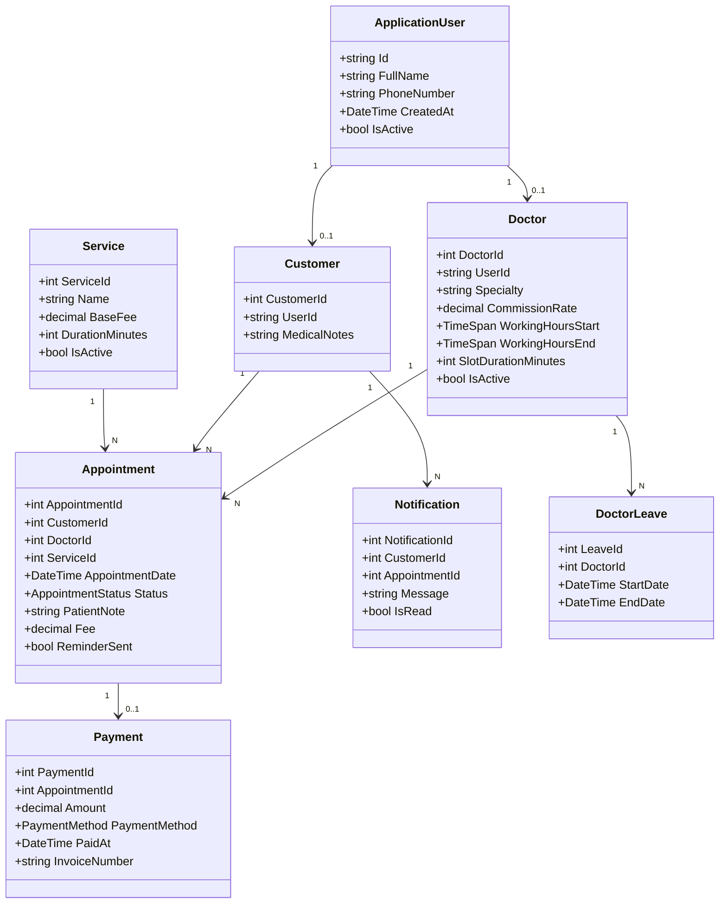
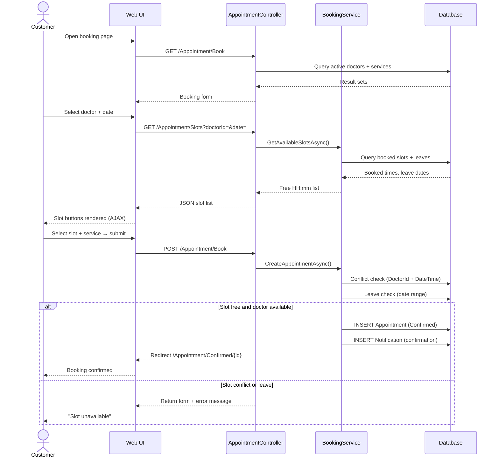
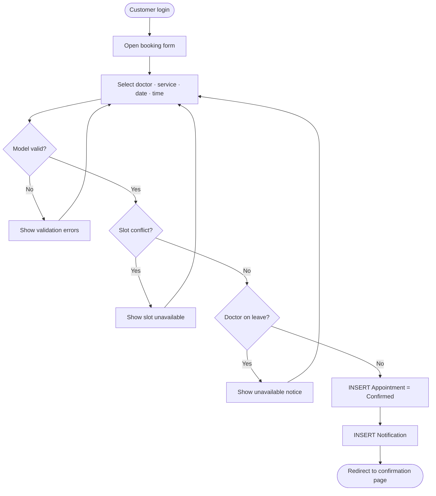
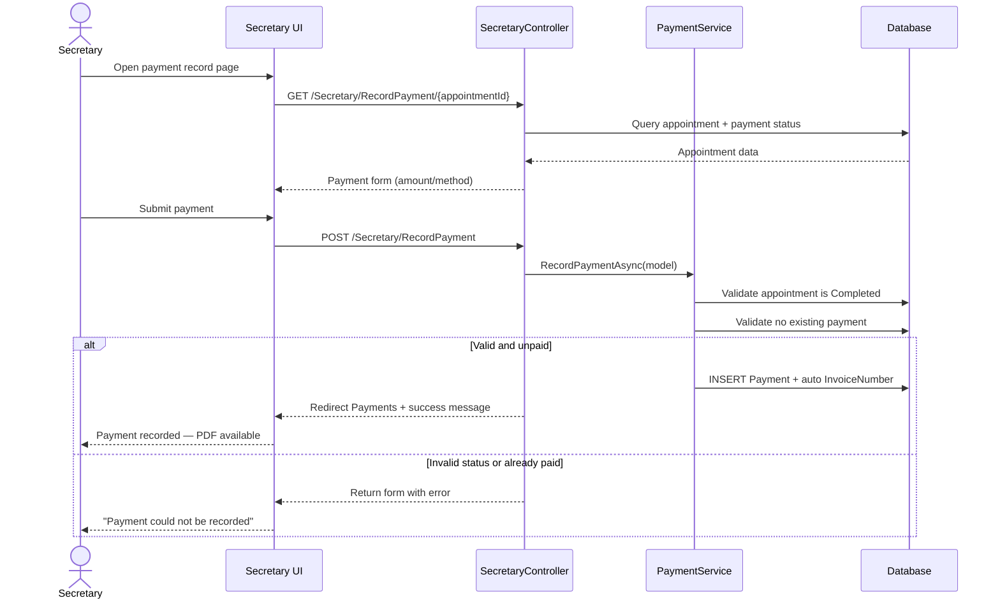
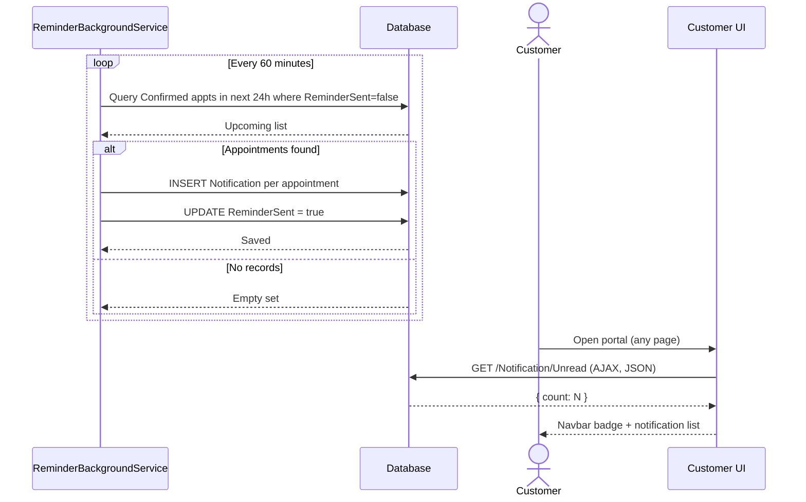
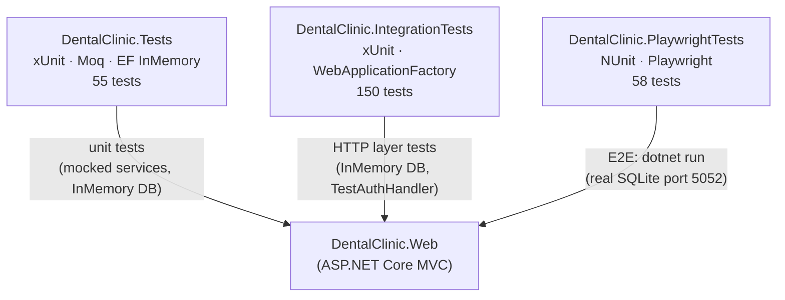
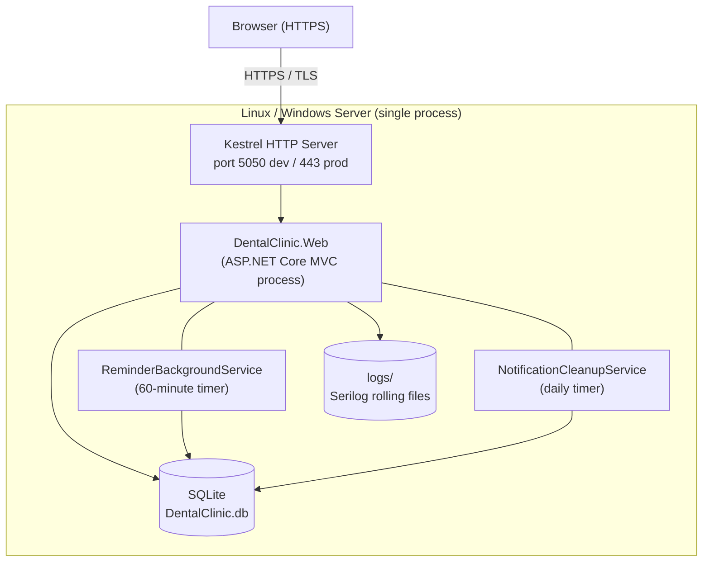
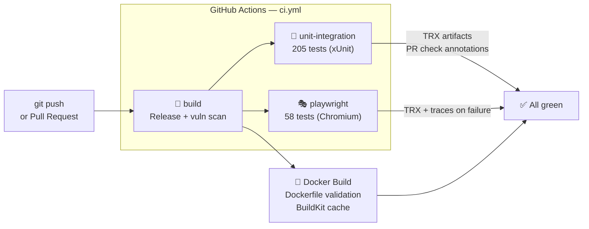

# 4+1 Software Architecture Document (SAD)
## DentaCare — Dental Clinic Online Appointment & Management System

---

> **Document Version:** 2.0
> **Date:** 2026-05-19
> **Methodology:** Kruchten's 4+1 Architectural View Model
> **Technology Stack:** ASP.NET Core 9 MVC · Entity Framework Core 9 · SQLite · Bootstrap 5
> **Test Coverage:** 55 unit · 150 integration · 58 Playwright E2E = **263 total tests**
> **CI/CD:** GitHub Actions (build → unit/integration + E2E + Docker, parallel jobs)

---

## 0. System Selection

### 0.1 System Definition
The selected system is a **Dental Clinic Online Appointment & Management System** designed to support appointment operations, role-based access, and core clinic administration in a single web platform.

### 0.2 Purpose of the System
The system digitizes and coordinates daily clinic workflows traditionally handled manually — phone booking, paper-based schedule tracking, and fragmented payment records. It provides a structured software solution aligned with modern architecture principles.

### 0.3 Target Users

| Actor | Description |
|-------|-------------|
| **Secretary (Admin)** | Manages doctors, appointments, services, customers, and payments |
| **Doctor** | Monitors personal schedule, patient notes, and appointment completion |
| **Customer (Patient)** | Registers, logs in, books appointments, tracks visits |
| **System (Automated)** | Executes reminder generation and notification cleanup as background processes |

### 0.4 Main Functionalities
- Role-based authentication and authorization (Secretary / Doctor / Customer).
- Appointment slot browsing and booking with real-time AJAX slot loading.
- Appointment cancellation and completion lifecycle management.
- Secretary-side calendar, doctor management, leave tracking, and payment recording.
- Revenue and earnings visibility with PDF invoice generation (QuestPDF).
- Automated in-app reminder generation for upcoming appointments (background service, 60-min interval).
- Slot conflict prevention, doctor leave validation, and business-rule enforcement at DB level.
- Security headers, HTTPS enforcement, rate limiting, and account lockout.

---

## 1. Use Case View

The Use Case View captures the **functional requirements** from each actor's perspective. It serves as the central document driving all other architectural views.

### 1.1 System Actors

| Actor | Role | Authority Level |
|-------|------|-----------------|
| **Secretary (Admin)** | System administrator and clinic operations manager | Full system access |
| **Doctor** | Licensed dental practitioner | Restricted to own schedule & data |
| **Customer (Patient)** | Registered clinic patient | Self-service appointment management |
| **System (Automated)** | Background job / scheduler | Internal only — no login |

---

### 1.2 Use Cases by Actor

#### Secretary (Admin) Use Cases

| ID | Use Case | Description |
|----|----------|-------------|
| UC-S01 | **Login / Logout** | Authenticates into the admin panel using credentials. |
| UC-S02 | **Manage Doctors** | Creates, updates, activates/deactivates doctor profiles. Sets specialty, commission rate, working hours, slot duration, and leave records. |
| UC-S03 | **View All Calendars** | Views the daily appointment calendar for all doctors simultaneously. |
| UC-S04 | **Create Manual Appointment** | Creates a new appointment on behalf of a patient (phone-in booking). |
| UC-S05 | **Cancel / Reschedule Appointment** | Cancels or moves any appointment in the system via AJAX slot selection. |
| UC-S06 | **Record Payment** | Records a payment against a completed appointment, entering amount and method. |
| UC-S07 | **Generate Invoice** | Creates a PDF invoice (QuestPDF) for a patient's visit with auto-generated invoice number. |
| UC-S08 | **View Payment Dashboard** | Displays total revenue, outstanding payments, and per-doctor earnings summaries. |
| UC-S09 | **Manage Customers** | Views patient list and account status. |
| UC-S10 | **Manage Services / Treatments** | Defines, edits, and toggles availability of dental treatments and their base fees. |

---

#### Doctor Use Cases

| ID | Use Case | Description |
|----|----------|-------------|
| UC-D01 | **Login / Logout** | Authenticates into the doctor's private dashboard. |
| UC-D02 | **View Daily Schedule** | Views the list of today's appointments in chronological order. |
| UC-D03 | **View Weekly Calendar** | Views a 7-day calendar of upcoming appointments. |
| UC-D04 | **View Patient Notes** | Reads notes attached to each upcoming appointment. |
| UC-D05 | **View Earnings Summary** | Views commission-based earnings (fee × rate) for the current day/week. |
| UC-D06 | **Mark Appointment as Completed** | Changes appointment status to "Completed" after the patient's visit. |

---

#### Customer (Patient) Use Cases

| ID | Use Case | Description |
|----|----------|-------------|
| UC-C01 | **Register** | Creates a new patient account with name, contact info, date of birth, and password. |
| UC-C02 | **Login / Logout** | Authenticates into the patient portal. |
| UC-C03 | **Browse Available Slots** | Selects a doctor and date, views all unbooked time slots via AJAX. |
| UC-C04 | **Book Appointment** | Reserves a selected time slot, optionally adding a complaint note. |
| UC-C05 | **Cancel Appointment** | Cancels an upcoming appointment (subject to status business rules). |
| UC-C06 | **View Upcoming Appointments** | Sees all future confirmed appointments. |
| UC-C07 | **View Appointment History** | Reviews all past completed/cancelled appointments. |
| UC-C08 | **View Payment History** | Lists all invoices and payments associated with their account. |
| UC-C09 | **Update Profile** | Changes personal details (name, phone, date of birth) or password. |

---

#### System (Automated) Use Cases

| ID | Use Case | Description |
|----|----------|-------------|
| UC-SYS01 | **Send Appointment Reminders** | Background job checks for confirmed appointments within 24 hours and creates in-app notification records. Runs every 60 minutes; `ReminderSent` flag prevents duplicates. |
| UC-SYS02 | **Enforce Slot Conflict Check** | Automatically rejects booking requests that overlap with an existing confirmed appointment for the same doctor. |
| UC-SYS03 | **Notification Cleanup** | Background job removes read notifications older than 30 days. Runs once daily. |

---

### 1.3 Use Case Diagram

```mermaid
flowchart LR
    Secretary["Secretary (Admin)"]
    Doctor["Doctor"]
    Customer["Customer (Patient)"]
    System["System (Automated)"]

    subgraph SEC["Secretary Portal Use Cases"]
        UC_S02["Manage Doctors"]
        UC_S03["View All Calendars"]
        UC_S04["Create Manual Appointment"]
        UC_S05["Cancel / Reschedule"]
        UC_S06["Record Payment"]
        UC_S07["Generate PDF Invoice"]
        UC_S08["View Payment Dashboard"]
        UC_S09["Manage Customers"]
        UC_S10["Manage Services"]
    end

    subgraph DOC["Doctor Portal Use Cases"]
        UC_D02["View Daily Schedule"]
        UC_D03["View Weekly Calendar"]
        UC_D04["View Patient Notes"]
        UC_D05["View Earnings Summary"]
        UC_D06["Mark as Completed"]
    end

    subgraph CUS["Customer Portal Use Cases"]
        UC_C01["Register"]
        UC_C02["Login / Logout"]
        UC_C03["Browse Slots (AJAX)"]
        UC_C04["Book Appointment"]
        UC_C05["Cancel Appointment"]
        UC_C06["View Upcoming"]
        UC_C07["View History"]
        UC_C08["Payment History"]
        UC_C09["Update Profile"]
    end

    subgraph SYS["Automated Use Cases"]
        UC_SYS01["Send Reminders"]
        UC_SYS02["Conflict Check"]
        UC_SYS03["Notification Cleanup"]
    end

    Secretary --> UC_S02
    Secretary --> UC_S03
    Secretary --> UC_S04
    Secretary --> UC_S05
    Secretary --> UC_S06
    Secretary --> UC_S07
    Secretary --> UC_S08
    Secretary --> UC_S09
    Secretary --> UC_S10

    Doctor --> UC_D02
    Doctor --> UC_D03
    Doctor --> UC_D04
    Doctor --> UC_D05
    Doctor --> UC_D06

    Customer --> UC_C01
    Customer --> UC_C02
    Customer --> UC_C03
    Customer --> UC_C04
    Customer --> UC_C05
    Customer --> UC_C06
    Customer --> UC_C07
    Customer --> UC_C08
    Customer --> UC_C09

    System --> UC_SYS01
    System --> UC_SYS02
    System --> UC_SYS03

    classDef actor fill:#16324f,color:#ffffff,stroke:#16324f;
    classDef usecase fill:#e8f0fb,color:#1a2b3c,stroke:#4b6b8a;
    class Secretary,Doctor,Customer,System actor;
    class UC_S02,UC_S03,UC_S04,UC_S05,UC_S06,UC_S07,UC_S08,UC_S09,UC_S10 usecase;
    class UC_D02,UC_D03,UC_D04,UC_D05,UC_D06 usecase;
    class UC_C01,UC_C02,UC_C03,UC_C04,UC_C05,UC_C06,UC_C07,UC_C08,UC_C09 usecase;
    class UC_SYS01,UC_SYS02,UC_SYS03 usecase;
```



### 1.4 Business Rules

| BR | Rule |
|----|------|
| **BR-01** | No two appointments can be booked for the same Doctor at the same date and time. Enforced at the application layer and at the database layer via a unique index on `(DoctorId, AppointmentDate)`. |
| **BR-02** | A Customer can only cancel an appointment that is in `Pending` or `Confirmed` status. Completed appointments cannot be cancelled. |
| **BR-03** | A payment can only be recorded against an appointment in `Completed` status. |
| **BR-04** | A Doctor can only view appointments assigned to their own `DoctorId`; cross-doctor data is inaccessible. |
| **BR-05** | The system automatically generates a reminder notification for any `Confirmed` appointment within 24 hours of its scheduled time. The `ReminderSent` boolean flag on `Appointment` prevents duplicate notifications. |
| **BR-06** | Doctor commission/earnings are calculated as: `AppointmentFee × DoctorCommissionRate`. |
| **BR-07** | Login is rate-limited to 10 attempts per minute per IP. Five consecutive failed login attempts trigger an account lockout lasting 15 minutes. |

---

### 1.5 Related Code Snippets

#### Snippet 1 — Booking UI Form (AJAX Slot Loading)

```cshtml
<form asp-action="Book" method="post" id="booking-form">
    @Html.AntiForgeryToken()
    <select asp-for="DoctorId" class="form-select" id="select-doctor">
        <option value="">— Choose a doctor —</option>
    </select>
    <input type="date" id="select-date" class="form-control" />
    <div id="slot-section" style="display:none;">
        <div class="slot-grid" id="slot-grid"></div>
        <input type="hidden" asp-for="AppointmentDate" id="selected-slot-input" />
    </div>
    <button type="submit" class="btn btn-dc-primary" id="btn-book">Confirm Booking</button>
</form>
```

#### Snippet 2 — Slot AJAX Endpoint

```csharp
[HttpGet]
public async Task<IActionResult> Slots(int doctorId, DateTime date)
{
    var slots = await _bookingService.GetAvailableSlotsAsync(doctorId, date);
    return Json(slots.Select(s => s.ToString("HH:mm")));
}
```

---

## 2. Logical View

The Logical View describes the **static structure** of the system — domain entities, attributes, and relationships.

### 2.1 Entity Descriptions

#### `ApplicationUser` *(extends ASP.NET Core IdentityUser)*

Central identity entity. All actors share this table, differentiated by **Role**.

| Field | Type | Description |
|-------|------|-------------|
| `Id` | `string` (GUID) | Primary Key (inherited from IdentityUser) |
| `FullName` | `string` | Display name |
| `PhoneNumber` | `string?` | Contact phone |
| `DateOfBirth` | `DateTime?` | Optional — for patient records |
| `CreatedAt` | `DateTime` | Account creation timestamp |
| `IsActive` | `bool` | Soft-delete flag |

**Roles:** `Secretary`, `Doctor`, `Customer` — managed via `AspNetRoles`.

---

#### `Doctor`

| Field | Type | Description |
|-------|------|-------------|
| `DoctorId` | `int` | Primary Key |
| `UserId` | `string` | FK → `ApplicationUser.Id` |
| `Specialty` | `string` | e.g., "Orthodontics", "Endodontics" |
| `CommissionRate` | `decimal` | Percentage of appointment fee earned (e.g., 0.70 = 70%) |
| `WorkingHoursStart` | `TimeSpan` | Start of daily working hours |
| `WorkingHoursEnd` | `TimeSpan` | End of daily working hours |
| `SlotDurationMinutes` | `int` | Default appointment duration |
| `IsActive` | `bool` | Can be deactivated by secretary |

**Relationships:** 1 Doctor → N Appointments · 1 Doctor → N DoctorLeave records

---

#### `Customer`

| Field | Type | Description |
|-------|------|-------------|
| `CustomerId` | `int` | Primary Key |
| `UserId` | `string` | FK → `ApplicationUser.Id` |
| `MedicalNotes` | `string?` | Secretary-entered patient medical background |

**Relationships:** 1 Customer → N Appointments · 1 Customer → N Notifications

---

#### `Service`

| Field | Type | Description |
|-------|------|-------------|
| `ServiceId` | `int` | Primary Key |
| `Name` | `string` | e.g., "Root Canal", "Teeth Whitening" |
| `Description` | `string?` | Details of the service |
| `BaseFee` | `decimal` | Standard price for this service |
| `DurationMinutes` | `int` | Estimated appointment duration |
| `IsActive` | `bool` | Toggle service availability |

---

#### `Appointment`

The core transactional entity of the system.

| Field | Type | Description |
|-------|------|-------------|
| `AppointmentId` | `int` | Primary Key |
| `CustomerId` | `int` | FK → `Customer.CustomerId` |
| `DoctorId` | `int` | FK → `Doctor.DoctorId` |
| `ServiceId` | `int` | FK → `Service.ServiceId` |
| `AppointmentDate` | `DateTime` | The scheduled date and time |
| `Status` | `enum` | `Pending`, `Confirmed`, `Completed`, `Cancelled` |
| `PatientNote` | `string?` | Patient's complaint or note at time of booking |
| `SecretaryNote` | `string?` | Internal note added by the secretary |
| `Fee` | `decimal` | Actual fee charged (may differ from `BaseFee`) |
| `ReminderSent` | `bool` | Prevents duplicate reminder notifications (BR-05) |
| `CreatedAt` | `DateTime` | When the appointment was booked |
| `CreatedByUserId` | `string?` | Set to secretary's ID if manually created |

**Unique Constraint:** `(DoctorId, AppointmentDate)` — enforces BR-01 at database level.

---

#### `Payment`

| Field | Type | Description |
|-------|------|-------------|
| `PaymentId` | `int` | Primary Key |
| `AppointmentId` | `int` | FK → `Appointment.AppointmentId` (unique — one payment per appointment) |
| `Amount` | `decimal` | Amount paid |
| `PaymentMethod` | `enum` | `Cash`, `CreditCard`, `BankTransfer` |
| `PaidAt` | `DateTime` | Transaction timestamp |
| `RecordedByUserId` | `string` | FK → `ApplicationUser.Id` (the secretary) |
| `InvoiceNumber` | `string` | Auto-generated reference (e.g., `INV-20260519-00001`) |

---

#### `Notification`

| Field | Type | Description |
|-------|------|-------------|
| `NotificationId` | `int` | Primary Key |
| `CustomerId` | `int` | FK → `Customer.CustomerId` |
| `AppointmentId` | `int?` | FK → `Appointment.AppointmentId` |
| `Message` | `string` | Notification text |
| `IsRead` | `bool` | Read status |
| `CreatedAt` | `DateTime` | When the notification was generated |

---

#### `DoctorLeave`

| Field | Type | Description |
|-------|------|-------------|
| `LeaveId` | `int` | Primary Key |
| `DoctorId` | `int` | FK → `Doctor.DoctorId` |
| `StartDate` | `DateTime` | Leave start |
| `EndDate` | `DateTime` | Leave end |
| `Reason` | `string?` | Optional explanation |

---

### 2.2 Entity Relationship Diagram



### 2.3 Class Diagram



### 2.4 Backend Structure and Layer Responsibilities

```
Controllers Layer   — handles HTTP requests; one controller per functional area
Service Layer       — encapsulates business logic; interface contracts for testability
Data Access Layer   — AppDbContext (EF Core 9): entities, relationships, unique indexes, migrations
Identity Layer      — ApplicationUser + roles; cookie auth, lockout, antiforgery
Background Layer    — IHostedService implementations: ReminderBackgroundService, NotificationCleanupService
```

### 2.5 Key Design Decisions

| Decision | Choice | Rationale |
|----------|--------|-----------|
| ORM | EF Core 9 Code-First | Full LINQ support, migrations, in-memory provider for tests |
| Database | SQLite | Zero-config, portable, file-based — suitable for single-clinic scale |
| Auth | ASP.NET Core Identity | Built-in lockout, password hashing, role claims, cookie sessions |
| UI | Server-rendered Razor + AJAX slots | No SPA complexity; real-time slot loading via native `fetch` API |
| PDF | QuestPDF (Community License) | Code-first invoice generation, no external service required |
| Logging | Serilog (file + console) | Structured logs with `AUDIT` prefix for security events |
| Background jobs | `IHostedService` | Native .NET, no external scheduler or message broker required |

### 2.6 Related Code Snippets

#### Entity Constraint Definitions

```csharp
builder.Entity<Appointment>()
    .HasIndex(a => new { a.DoctorId, a.AppointmentDate })
    .IsUnique()
    .HasDatabaseName("UX_Appointment_Doctor_DateTime");

builder.Entity<Payment>()
    .HasIndex(p => p.AppointmentId)
    .IsUnique()
    .HasDatabaseName("UX_Payment_AppointmentId");
```

---

## 3. Process View

The Process View captures the **dynamic behavior** of the system — key workflows showing how components interact at runtime.

### 3.1 Customer Books an Appointment (End-to-End)



#### Activity Diagram — Booking Decision Flow



#### Related Code Snippet — Booking Validation Pipeline

```csharp
bool slotTaken = await _db.Appointments.AnyAsync(a =>
    a.DoctorId == model.DoctorId
    && a.AppointmentDate == model.AppointmentDate
    && a.Status != AppointmentStatus.Cancelled);
if (slotTaken) return null;

bool onLeave = await _db.DoctorLeaves.AnyAsync(l =>
    l.DoctorId == model.DoctorId
    && l.StartDate.Date <= model.AppointmentDate.Date
    && l.EndDate.Date >= model.AppointmentDate.Date);
if (onLeave) return null;

_db.Appointments.Add(appointment);
await _db.SaveChangesAsync();

_db.Notifications.Add(notification);
await _db.SaveChangesAsync();
```

---

### 3.2 Secretary Records a Payment



#### Related Code Snippet — Payment Processing

```csharp
if (appointment.Status != AppointmentStatus.Completed) return null;
if (appointment.Payment != null) return null;

var invoiceNumber = $"INV-{DateTime.UtcNow:yyyyMMdd}-{appointment.AppointmentId:D5}";
var payment = new Payment
{
    AppointmentId   = model.AppointmentId,
    Amount          = model.Amount,
    PaymentMethod   = model.PaymentMethod,
    PaidAt          = DateTime.UtcNow,
    RecordedByUserId = secretaryUserId,
    InvoiceNumber   = invoiceNumber
};
_db.Payments.Add(payment);
await _db.SaveChangesAsync();
```

---

### 3.3 Automated Reminder (Background Job)



#### Related Code Snippet — Reminder Loop

```csharp
var upcomingAppointments = await db.Appointments
    .Where(a => a.Status == AppointmentStatus.Confirmed
             && !a.ReminderSent
             && a.AppointmentDate >= now
             && a.AppointmentDate <= cutoff)
    .ToListAsync();

foreach (var appointment in upcomingAppointments)
{
    db.Notifications.Add(notification);
    appointment.ReminderSent = true;
}
if (upcomingAppointments.Any())
    await db.SaveChangesAsync();
```

---

## 4. Development View

The Development View describes the **static organization** of the source code — packages, modules, build system, and test strategy.

### 4.1 Project Structure

```
DentaCare/                                  ← Solution root
├── DentalClinic.sln
├── global.json                             ← SDK pin: .NET 9.0.303 (latestPatch)
│
├── DentalClinic.Web/                       ← Main ASP.NET Core MVC application
│   ├── Controllers/
│   │   ├── AccountController.cs            ← Login (3 portals) · Register · Logout
│   │   ├── AppointmentController.cs        ← Customer booking: Book · Slots · Confirmed · Cancel · History
│   │   ├── CustomerController.cs           ← Dashboard · PaymentHistory · EditProfile
│   │   ├── DoctorController.cs             ← Schedule · CompleteAppointment
│   │   ├── SecretaryController.cs          ← Full admin: calendar · doctors · services · payments · leaves
│   │   ├── NotificationController.cs       ← AJAX badge count · All notifications list
│   │   └── HomeController.cs
│   │
│   ├── Services/
│   │   ├── IBookingService.cs / BookingService.cs       ← Slot generation, conflict check, book/cancel/complete/reschedule
│   │   ├── IPaymentService.cs / PaymentService.cs       ← Payment record, unpaid query
│   │   ├── IEmailService.cs / EmailService.cs           ← Email interface (SMTP stub)
│   │   ├── ReminderBackgroundService.cs                 ← IHostedService, 60-min timer
│   │   └── NotificationCleanupService.cs                ← IHostedService, daily cleanup (30-day TTL)
│   │
│   ├── Models/
│   │   ├── ApplicationUser.cs · Doctor.cs · Customer.cs
│   │   ├── Service.cs · Appointment.cs · Payment.cs
│   │   ├── Notification.cs · DoctorLeave.cs
│   │   └── Enums.cs                                    ← AppointmentStatus · PaymentMethod
│   │
│   ├── ViewModels/
│   │   ├── LoginViewModel.cs · RegisterViewModel.cs
│   │   ├── BookingViewModel.cs · EditProfileViewModel.cs
│   │   ├── PaymentRecordViewModel.cs · RescheduleAppointmentViewModel.cs
│   │   ├── CreateDoctorViewModel.cs
│   │   └── DoctorDashboardViewModel.cs · PaymentDashboardViewModel.cs
│   │
│   ├── Data/
│   │   ├── AppDbContext.cs                             ← EF Core context: relationships, unique indexes
│   │   └── Migrations/                                 ← EF Core migration history
│   │
│   ├── Views/                                          ← Razor views, role-scoped folders
│   │   ├── Account/ · Appointment/ · Customer/
│   │   ├── Doctor/ · Secretary/ · Notification/ · Home/
│   │   └── Shared/_Layout.cshtml                      ← Role-aware navbar, TempData flash messages
│   │
│   ├── wwwroot/                                        ← Bootstrap 5, Bootstrap Icons, jQuery (local CDN)
│   ├── appsettings.json
│   ├── appsettings.Development.json
│   ├── appsettings.Playwright.json                    ← Isolated test SQLite DB + test seed passwords
│   └── Program.cs                                     ← App composition root: DI, middleware, seed, security
│
├── DentalClinic.Tests/                                ← xUnit unit tests (55 tests)
│   ├── BookingServiceTests.cs
│   ├── PaymentServiceTests.cs
│   ├── EmailServiceTests.cs
│   ├── BackgroundServiceTests.cs
│   ├── BookingViewModelTests.cs
│   └── ViewModelValidationTests.cs
│
├── DentalClinic.IntegrationTests/                     ← xUnit integration tests (150 tests)
│   ├── DentalClinicFactory.cs                         ← WebApplicationFactory + InMemory DB + TestAuthHandler
│   ├── AuthTests.cs · AccountControllerTests.cs
│   ├── ControllerResponseTests.cs · HtmlContentTests.cs
│   ├── SecurityHeadersTests.cs · RateLimitTests.cs
│   ├── HomeRedirectTests.cs · NotificationAndSlotsTests.cs
│   └── NewFeaturesTests.cs
│
├── DentalClinic.PlaywrightTests/                      ← NUnit Playwright E2E tests (58 tests)
│   ├── ServerFixture.cs                               ← [SetUpFixture]: starts real app on port 5052, fresh SQLite per run
│   ├── PlaywrightTestBase.cs                          ← BaseURL, login helpers, auto tracing
│   ├── GlobalUsings.cs                                ← [assembly: Parallelizable(None)] — sequential execution
│   └── Tests/
│       ├── AuthTests.cs          ← 16 tests: login, register, logout, lockout, role guards, privacy
│       ├── BookingTests.cs       ←  6 tests: form load, AJAX slots, confirm, cancel, history
│       ├── CustomerTests.cs      ←  7 tests: dashboard, profile edit, payment history, cross-role deny
│       ├── DoctorTests.cs        ←  6 tests: dashboard, date param, cross-role deny
│       ├── SecretaryTests.cs     ← 19 tests: full admin panel (doctors, services, leaves, payments, calendar)
│       └── NotificationTests.cs  ←  4 tests: JSON endpoint, mark-as-read, navbar badge
│
├── .github/
│   └── workflows/
│       └── ci.yml                                     ← GitHub Actions: build · test · docker (parallel)
│
├── Dockerfile                                         ← Multi-stage: sdk:9.0 → aspnet:9.0, non-root user
├── .dockerignore                                      ← Excludes test projects, bins, secrets
├── docker-compose.yml                                 ← App + Prometheus + Grafana stack
├── prometheus/
│   └── prometheus.yml                                 ← Scrape config: dentacare:8080/metrics every 15s
└── grafana/
    └── provisioning/datasources/
        └── prometheus.yml                             ← Auto-provisioned Prometheus datasource
```

### 4.2 Module Dependency Diagram



### 4.3 Key NuGet Packages

| Package | Version | Purpose |
|---------|---------|---------|
| `Microsoft.AspNetCore.Identity.EntityFrameworkCore` | 9.0.4 | Authentication, roles, lockout, cookie sessions |
| `Microsoft.EntityFrameworkCore.Sqlite` | 9.0.4 | SQLite database provider |
| `Microsoft.EntityFrameworkCore.InMemory` | 9.0.4 | In-memory DB for unit/integration tests |
| `Serilog.AspNetCore` | 8.0.3 | Structured logging to file and console |
| `QuestPDF` | 2025.7.4 | Code-first PDF invoice generation |
| `prometheus-net.AspNetCore` | 8.2.1 | `GET /metrics` endpoint + `UseHttpMetrics()` middleware |
| `Microsoft.Playwright.NUnit` | 1.49.0 | Browser automation for E2E tests |
| `xunit` | 2.9.2 | Unit and integration test framework |
| `Moq` | 4.20.72 | Mock objects for service-layer unit tests |
| `coverlet.collector` | 6.0.2 | Code coverage collection in CI |

### 4.4 Test Strategy

| Layer | Framework | Count | Scope |
|-------|-----------|------:|-------|
| **Unit** | xUnit + Moq + EF InMemory | 55 | Service logic, ViewModel validation, background service behavior |
| **Integration** | xUnit + WebApplicationFactory | 150 | HTTP endpoints, auth flows, security headers, rate limiting, HTML content |
| **E2E** | NUnit + Playwright (Chromium) | 58 | Real browser, real SQLite, complete user flows for all three roles |
| **Total** | | **263** | |

**E2E infrastructure highlights:**
- `ServerFixture` (`[SetUpFixture]`) deletes stale SQLite DB, starts `dotnet run` on port 5052, polls until ready (90s timeout).
- Playwright environment seeds a test Secretary (`secretary@dentacare.com`), Doctor (`testdoctor@dentacare.com`), and Customer (`testcustomer@test.com`) for predictable login in every test.
- Rate limiting middleware is disabled in the `Playwright` environment to prevent login throttling during rapid sequential test runs.
- `PlaywrightTestBase` starts a trace before each test and saves it as a `.zip` artifact only on test failure.
- `[assembly: Parallelizable(ParallelScope.None)]` ensures all fixtures run sequentially since they share a single real server process.

---

## 5. Physical View

The Physical View describes how software is **deployed** onto hardware or cloud infrastructure and how environments are configured.

### 5.1 Deployment Topology



### 5.2 Environment Configuration

| Environment | Database | Port | Extra Seed | Rate Limit |
|-------------|----------|-----:|------------|:----------:|
| `Development` | `DentalClinic.db` | 5050 | Secretary + 8 Services | ✅ |
| `Production` | Configurable path | 443 | Secretary + 8 Services | ✅ |
| `Playwright` | `playwright-test.db` | 5052 | + Test Doctor + Customer | ❌ |
| `Testing` | In-memory (EF) | random | EF `EnsureCreated` | N/A |

### 5.3 Security Controls

| Control | Implementation |
|---------|---------------|
| **HTTPS enforcement** | `UseHttpsRedirection()` + `UseHsts()` (Production only) |
| **Security headers** | `X-Frame-Options: DENY` · `X-Content-Type-Options: nosniff` · `X-XSS-Protection` · `Referrer-Policy` · `Permissions-Policy` · `Content-Security-Policy` |
| **Anti-forgery** | `[ValidateAntiForgeryToken]` on all state-changing POST endpoints |
| **Rate limiting** | Fixed-window: 10 login/min, 5 register/min (keyed by IP) |
| **Account lockout** | 5 failed attempts → 15-minute lockout (ASP.NET Core Identity) |
| **Role authorization** | `[Authorize(Roles = "...")]` on all controller classes |
| **Audit logging** | Serilog `AUDIT` prefix on login success / failure / lockout events |
| **Health check** | `GET /health` — EF Core database connectivity probe |

### 5.4 CI/CD Pipeline



**Pipeline features:**
- `concurrency` cancels in-progress runs for the same branch/PR.
- NuGet packages, Playwright browsers, and Docker BuildKit layer cache are cached across runs.
- `dorny/test-reporter@v1` publishes TRX results as PR check annotations.
- Playwright trace `.zip` files uploaded as artifacts on failure for post-mortem debugging.
- `dotnet list package --vulnerable --include-transitive` blocks the build if known vulnerabilities are found.
- Docker job validates the multi-stage Dockerfile on every push (push to registry deferred to CD step).

---

## 6. Quality Assurance Summary

### 6.1 Test Coverage by Feature Area

| Feature | Unit | Integration | E2E |
|---------|:----:|:-----------:|:---:|
| Booking (slot logic, conflict, leave validation) | ✅ | ✅ | ✅ |
| Payment (status check, invoice generation) | ✅ | ✅ | ✅ |
| Email service (interface behavior) | ✅ | — | — |
| Background services (reminder, cleanup) | ✅ | — | — |
| ViewModel validation (data annotations, custom rules) | ✅ | ✅ | ✅ |
| Auth (login, register, logout, lockout) | — | ✅ | ✅ |
| Role guards (wrong portal, forbidden access) | — | ✅ | ✅ |
| Security headers (CSP, X-Frame-Options, etc.) | — | ✅ | — |
| Rate limiting (login / register throttle) | — | ✅ | — |
| Customer flows (book, cancel, profile, history) | — | — | ✅ |
| Doctor flows (dashboard, date param, cross-role) | — | — | ✅ |
| Secretary panel (doctors, services, leaves, payments) | — | — | ✅ |
| Notification system (AJAX badge, mark-read) | — | — | ✅ |

### 6.2 Non-Functional Requirements

| Requirement | Implementation | Status |
|-------------|---------------|:------:|
| Security (OWASP Top 10) | Anti-forgery, CSP, rate limiting, lockout, EF parameterized queries | ✅ |
| Observability | Serilog structured logs, AUDIT events, `GET /health` endpoint | ✅ |
| Testability | 263 automated tests, WebApplicationFactory, Playwright E2E | ✅ |
| Portability | SQLite (file-based, no server), Docker-compatible Kestrel | ✅ |
| Maintainability | Service/Controller separation, interface contracts, EF migration history | ✅ |
| Containerization | Dockerfile (multi-stage, non-root user, health check) + docker-compose | ✅ |
| Continuous Integration | GitHub Actions — 4 parallel jobs (build/test/playwright/docker), < 4 min | ✅ |

---

## Document Version History

| Version | Date | Changes |
|---------|------|---------|
| 1.0 | 2026-04-30 | Initial submission — Use Case View, Logical View, Process View (Stage 1 scope) |
| 2.0 | 2026-05-19 | Added Development View (Section 4) and Physical View (Section 5); added QA Summary (Section 6); corrected technology stack (SQLite, not SQL Server); added UC-SYS03 (notification cleanup), BR-07 (rate limiting / lockout); documented 263-test suite and GitHub Actions CI/CD pipeline |
| 2.1 | 2026-05-19 | Added Dockerfile + docker-compose + monitoring stack (Prometheus + Grafana); added prometheus-net.AspNetCore metrics middleware (`/metrics`); updated Section 4.1 project tree, Section 4.3 packages, Section 5.4 CI diagram and Section 6.2 non-functional requirements |
